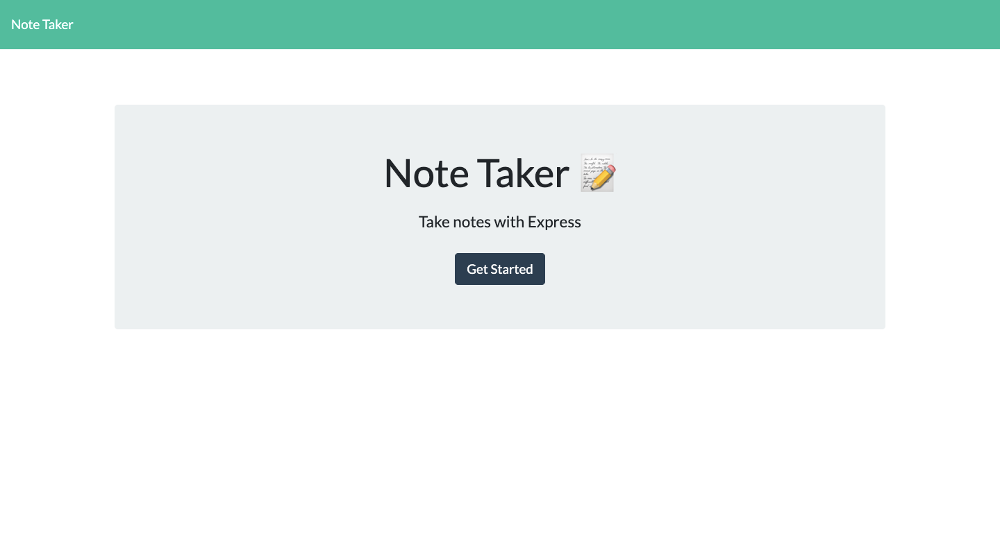
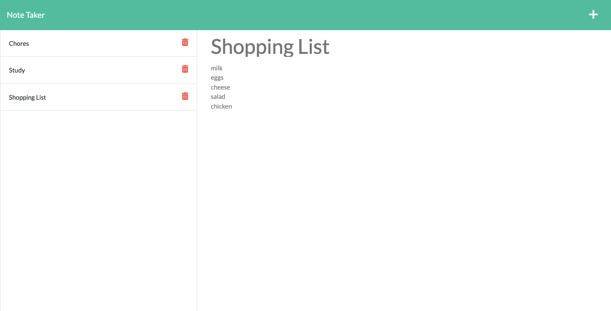

# Note Taker

 

## Description

This project is deployed on Heroku and allows users to write and save notes to organize their thoughts and keep track of tasks they need to complete. The project utilizes Express.js for the back end and persists the note data in a local JSON file.

## Installations

npm init -y

npm install express

npm install uuid

## Screenshots of Project

## Heroku Deployed Page

Click [here](https://easy-notetaker.herokuapp.com/)!

## License

 
Copyright © 2021 [Betty Chen](https://github.com/bchen41).  
This project is [MIT](https://github.com/bchen41/Note-Taker/blob/main/LICENSE) licensed.

## Contributing

All are welcomed to contribute as long as the standard industry guidelines are being followed.
Click [here](https://www.contributor-covenant.org/) for industry standard guidelines.

## Questions

For additional questions, contact me by reaching me at my [email](mailto:bettychen41@outlook.com).

You can find my other projects at my [GitHub](https://github.com/bchen41) profile.

Author: Betty Chen
